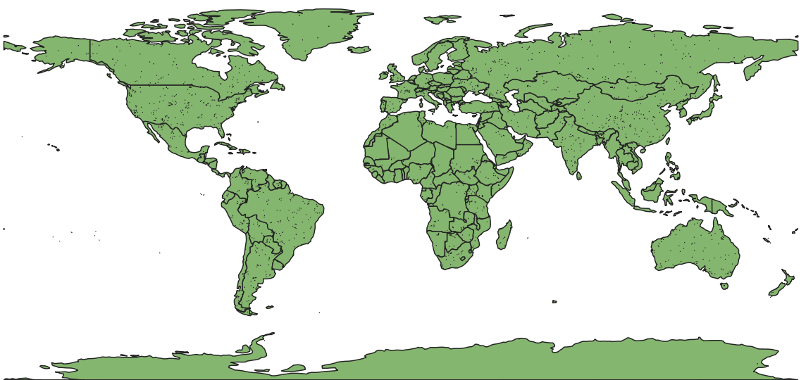
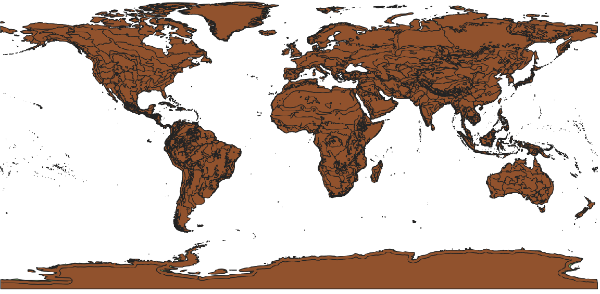

STAC API Benchmark
==================

|PyPI| |Status| |Python Version| |License|

|Read the Docs| |Tests| |Codecov|

|pre-commit| |Black|

.. |PyPI| image:: https://img.shields.io/pypi/v/stac-api-benchmark.svg
   :target: https://pypi.org/project/stac-api-benchmark/
   :alt: PyPI
.. |Status| image:: https://img.shields.io/pypi/status/stac-api-benchmark.svg
   :target: https://pypi.org/project/stac-api-benchmark/
   :alt: Status
.. |Python Version| image:: https://img.shields.io/pypi/pyversions/stac-api-benchmark
   :target: https://pypi.org/project/stac-api-benchmark
   :alt: Python Version
.. |License| image:: https://img.shields.io/pypi/l/stac-api-benchmark
   :target: https://opensource.org/licenses/Apache-2.0
   :alt: License
.. |Read the Docs| image:: https://img.shields.io/readthedocs/stac-api-benchmark/latest.svg?label=Read%20the%20Docs
   :target: https://stac-api-benchmark.readthedocs.io/
   :alt: Read the documentation at https://stac-api-benchmark.readthedocs.io/
.. |Tests| image:: https://github.com/philvarner/stac-api-benchmark/workflows/Tests/badge.svg
   :target: https://github.com/philvarner/stac-api-benchmark/actions?workflow=Tests
   :alt: Tests
.. |Codecov| image:: https://codecov.io/gh/philvarner/stac-api-benchmark/branch/main/graph/badge.svg
   :target: https://codecov.io/gh/philvarner/stac-api-benchmark
   :alt: Codecov
.. |pre-commit| image:: https://img.shields.io/badge/pre--commit-enabled-brightgreen?logo=pre-commit&logoColor=white
   :target: https://github.com/pre-commit/pre-commit
   :alt: pre-commit
.. |Black| image:: https://img.shields.io/badge/code%20style-black-000000.svg
   :target: https://github.com/psf/black
   :alt: Black

Features
--------

* STEP - A vector dataset of 1983 ecoregions throughout the world. These are simple 5 point GeoJSON Polygons covering
  a few square kilometers. These are much smaller than most gridded data products. For example, Sentinel-2 L2A scenes
  are 10,000 square km, so they are effectively points when compared against those sizes. The size of these polygons
  are closer to data produced closer to the ground, for example, by commercial drones.

* TNC Ecoregions - A vector dataset of 814 large polygons multipolygons covering the entire earth. These
  irregular shapes are larger than most gridded data product scenes and typically span many such grid squares.

* Country political boundaries - Many analyses are done at the country level, as they are funded by the country's
  government. There are two benchmarks here - one querying for all the items in a country during a single month, and
  another that only retrieves the first 1000 results, but sorts by cloud cover ascending.

* Random queries. Generate queries with a random geometry and properties filtering on 3 integer-valued properties.

* Repeated request for same item - Benchmarks caching of a single item.

* Sorts - Datetime, Cloud Cover, Created - Benchmarks the performance of results sorting.

Installation
------------

Currently, you must clone the repo and run from there.  After cloning, run:

.. code:: console

   $ poetry install

**TODO** You can install *STAC API Benchmark* via pip_ from PyPI_:

.. code:: console

   $ pip install stac-api-benchmark

Usage
-----

.. code:: console

    $ poetry run stac-api-benchmark \
        --verbosity INFO \
        --url http://localhost:8080
        --collection sentinel-2-l2a \
        --queryable cloud_cover \
        --queryable cloud_shadow_percentage \
        --queryable properties.s2:nodata_pixel_percentage

Options:

- **--url** - The root / Landing Page url for a STAC API
- **--collection** - The collection to operate on
- **--concurrency** - The number of concurrent request to run
- **--seed** - For the random query generation, the seed value. This allows you to consistently generate
  random queries.
- **--queryable** - Supports multiple parameters. The name of a queryable to include in random queries, ranged 0-100.
- **--max-items** - Request this maximum number of items from the API for each query in the feature
  collection queries. Otherwise, if there are
  large numbers of results for these queries, it may take a very long to paginate through them, and this doesn't
  necessarily reflect something a user will do in practice. This defaults to 10000.
- **--num-features** - Only query this number of features from the feature collection inputs. This is useful if you just
  want to run a quicker test with a few queries rather than the thousands in each of the features tests
- **--num-random** - The number of random queries to run.
- **--verbosity** - DEBUG, INFO, WARNING, ERROR, or CRITICAL to set the level of logging that will be in the output
- **--timeout** - Amount of time (in seconds) to run searches before considering them to have timed out

Contributing
------------

Contributions are very welcome.
To learn more, see the `Contributor Guide`_.

License
-------

Distributed under the terms of the `Apache 2.0 license`_,
*STAC API Benchmark* is free and open source software.

Issues
------

If you encounter any problems,
please `file an issue`_ along with a detailed description.

Credits
-------

This project was generated from `@cjolowicz`_'s `Hypermodern Python Cookiecutter`_ template.

.. _@cjolowicz: https://github.com/cjolowicz
.. _Cookiecutter: https://github.com/audreyr/cookiecutter
.. _Apache 2.0 license: https://opensource.org/licenses/Apache-2.0
.. _PyPI: https://pypi.org/
.. _Hypermodern Python Cookiecutter: https://github.com/cjolowicz/cookiecutter-hypermodern-python
.. _file an issue: https://github.com/philvarner/stac-api-benchmark/issues
.. _pip: https://pip.pypa.io/
.. github-only
.. _Contributor Guide: CONTRIBUTING.rst
.. _Usage: https://stac-api-benchmark.readthedocs.io/en/latest/usage.html
